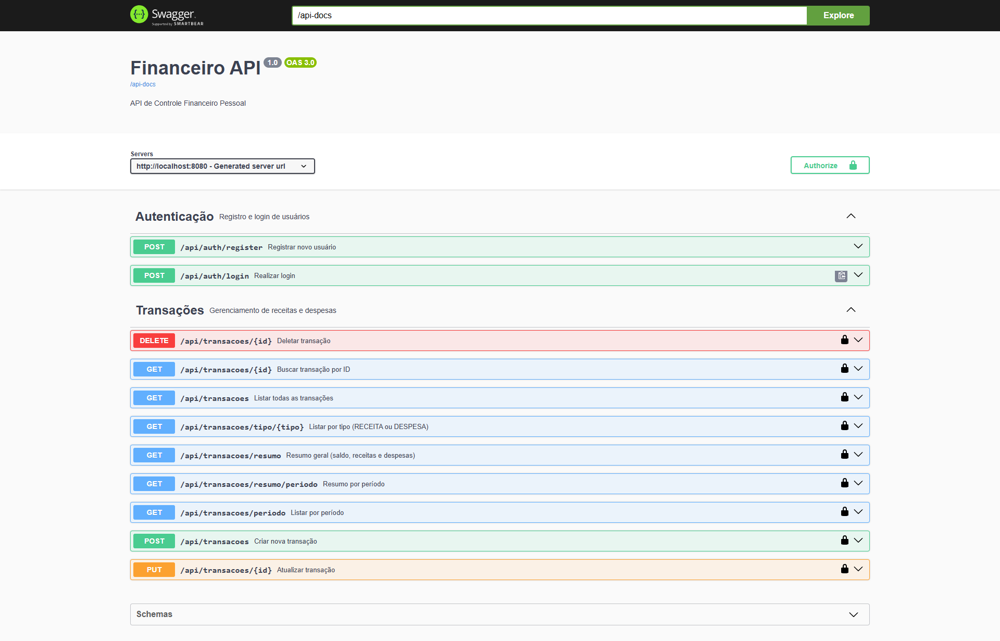

# Financeiro API



API REST de Controle Financeiro Pessoal com autenticação JWT.

## Tecnologias

| Tecnologia | Versão |
|---|---|
| Java | 21 |
| Spring Boot | 3.2.5 |
| Spring Security + JWT | - |
| PostgreSQL | - |
| Swagger / OpenAPI | 2.5.0 |
| Lombok | - |
| Maven | 3.8+ |

---

## Funcionalidades

- ✅ Registro e login com JWT
- ✅ CRUD completo de transações (receitas e despesas)
- ✅ Filtro por tipo (RECEITA / DESPESA)
- ✅ Filtro por período
- ✅ Resumo financeiro (saldo, total receitas, total despesas)
- ✅ Categorias de transações
- ✅ Documentação Swagger

---

## Endpoints

### Autenticação
| Método | Endpoint | Descrição |
|---|---|---|
| POST | `/api/auth/register` | Registrar usuário |
| POST | `/api/auth/login` | Login |

### Transações (requer token JWT)
| Método | Endpoint | Descrição |
|---|---|---|
| POST | `/api/transacoes` | Criar transação |
| GET | `/api/transacoes` | Listar todas |
| GET | `/api/transacoes/{id}` | Buscar por ID |
| GET | `/api/transacoes/tipo/{tipo}` | Filtrar por tipo |
| GET | `/api/transacoes/periodo?inicio=&fim=` | Filtrar por período |
| PUT | `/api/transacoes/{id}` | Atualizar |
| DELETE | `/api/transacoes/{id}` | Deletar |
| GET | `/api/transacoes/resumo` | Resumo geral |
| GET | `/api/transacoes/resumo/periodo?inicio=&fim=` | Resumo por período |

---

## Como Executar

### Pré-requisitos
- Java 21
- Maven 3.8+
- PostgreSQL instalado e rodando

### 1. Criar o banco
```sql
CREATE DATABASE financeiro_db;
```

### 2. Configurar credenciais
Edite `src/main/resources/application.properties`:
```properties
spring.datasource.username=postgres
spring.datasource.password=sua_senha
```

### 3. Rodar a aplicação
```bash
mvn spring-boot:run
```

### 4. Acessar o Swagger
```
http://localhost:8080/swagger-ui.html
```

---

## Exemplo de uso no Postman

### 1. Registrar
```json
POST /api/auth/register
{
  "nome": "João Silva",
  "email": "joao@email.com",
  "senha": "123456"
}
```

### 2. Login → copiar o token retornado
```json
POST /api/auth/login
{
  "email": "joao@email.com",
  "senha": "123456"
}
```

### 3. Criar transação (Authorization: Bearer {token})
```json
POST /api/transacoes
{
  "descricao": "Salário",
  "valor": 5000.00,
  "tipo": "RECEITA",
  "categoria": "SALARIO",
  "data": "2026-05-01"
}
```

### 4. Ver resumo
```
GET /api/transacoes/resumo
```
```json
{
  "totalReceitas": 5000.00,
  "totalDespesas": 0.00,
  "saldo": 5000.00
}
```

---

## Categorias disponíveis

**Receitas:** `SALARIO`, `FREELANCE`, `INVESTIMENTO`, `OUTROS_RECEITA`

**Despesas:** `ALIMENTACAO`, `TRANSPORTE`, `MORADIA`, `SAUDE`, `EDUCACAO`, `LAZER`, `VESTUARIO`, `OUTROS_DESPESA`
